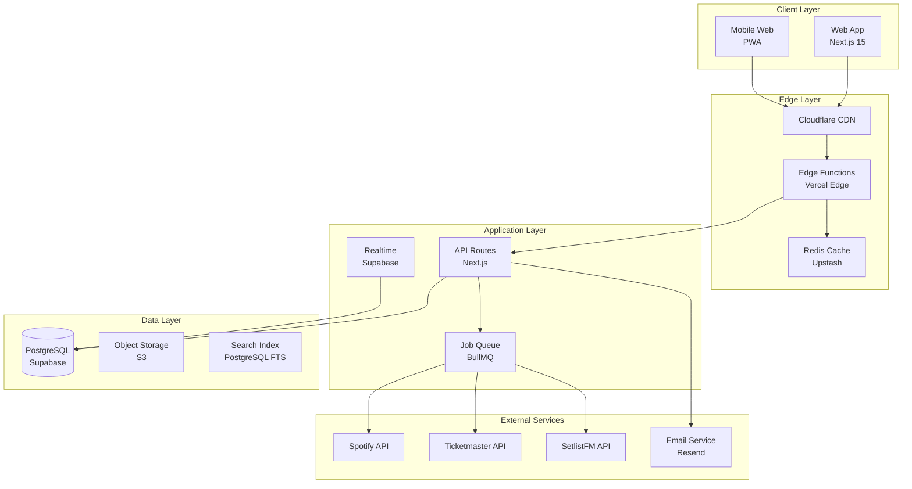
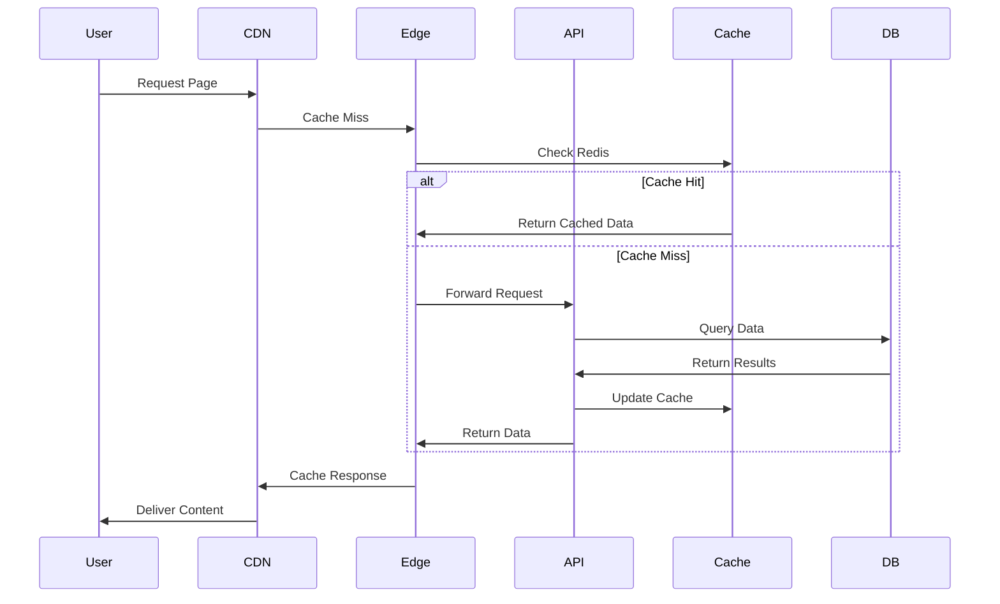
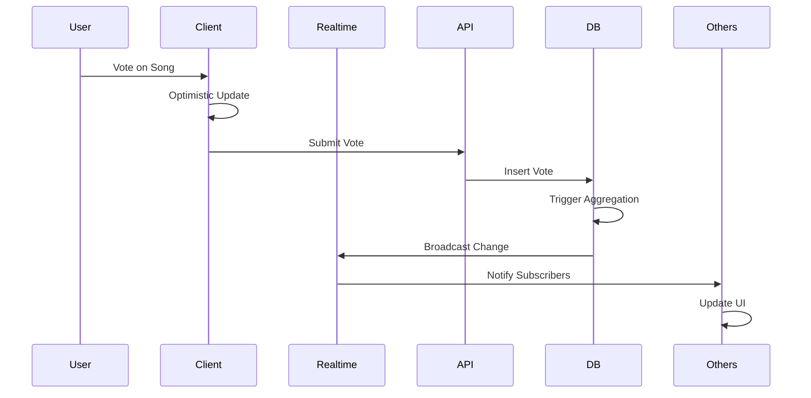

# 🏗️ MySetlist Architecture Overview

**Version**: 1.0.0  
**Architecture Pattern**: Next-Forge Monorepo with Edge-First Design  
**Last Updated**: January 2025

## 📐 System Architecture



## 🎯 Design Principles

### 1. **Edge-First Architecture**
- Critical paths run on Edge Runtime for <50ms response times
- Global distribution via Vercel Edge Network
- Intelligent caching at edge locations
- Minimal cold starts with optimized bundles

### 2. **Real-Time First**
- Supabase Realtime for live updates
- Optimistic UI updates for instant feedback
- Presence system for collaborative features
- WebSocket fallback for reliability

### 3. **Performance Obsessed**
- React Server Components for faster initial loads
- Aggressive caching at multiple layers
- Database query optimization with indexes
- Bundle splitting and lazy loading

### 4. **Security by Design**
- Row Level Security (RLS) in PostgreSQL
- API rate limiting with Redis
- CSRF protection on all mutations
- Content Security Policy (CSP) headers

## 🛠️ Technology Stack

### **Frontend**
```typescript
// Core Technologies
- Framework: Next.js 15.3.4 (App Router)
- UI Library: React 19.0.0
- Language: TypeScript 5.8.3
- Styling: Tailwind CSS 3.4.x
- Components: shadcn/ui + Radix UI
- State: Zustand + React Query
- Forms: React Hook Form + Zod
- Animation: Framer Motion
```

### **Backend**
```typescript
// API & Services
- Runtime: Node.js 20.x + Edge Runtime
- API: Next.js API Routes
- Database: PostgreSQL 15 (Supabase)
- Cache: Upstash Redis
- Queue: BullMQ
- Auth: Supabase Auth
- Email: Resend API
- File Storage: Supabase Storage
```

### **Infrastructure**
```yaml
# Deployment & Monitoring
- Hosting: Vercel
- CDN: Cloudflare
- Monitoring: Sentry + Vercel Analytics
- Logging: Structured logs to Vercel
- CI/CD: GitHub Actions
- IaC: Terraform
- Container: Docker (for local dev)
```

## 📂 Project Structure

```
mysetlist-s4-1/
├── apps/
│   ├── web/                    # Main Next.js application
│   │   ├── app/                # App Router pages and API
│   │   │   ├── (home)/         # Homepage routes
│   │   │   ├── api/            # API routes (consolidated)
│   │   │   ├── artists/        # Artist pages
│   │   │   ├── shows/          # Show pages
│   │   │   ├── venues/         # Venue pages
│   │   │   └── components/     # Shared components
│   │   ├── lib/                # Utilities and helpers
│   │   └── public/             # Static assets
│   └── email/                  # Email templates (future)
├── packages/
│   ├── database/               # Database schema and queries
│   ├── auth/                   # Authentication logic
│   ├── ui/                     # Shared UI components
│   ├── external-apis/          # API integrations
│   └── types/                  # Shared TypeScript types
├── infrastructure/             # Terraform configs
└── scripts/                    # Build and deployment scripts
```

## 🔄 Data Flow Architecture

### **1. User Request Flow**


### **2. Real-Time Voting Flow**


## 🗄️ Database Architecture

### **Core Schema Design**
```sql
-- Simplified core relationships
artists (id, name, spotify_id, image_url, genres[], popularity)
  └─ shows (id, artist_id, venue_id, date, ticket_url)
      └─ setlists (id, show_id, created_by, locked_at)
          └─ setlist_songs (id, setlist_id, song_id, position)
              └─ votes (id, setlist_song_id, user_id, score)

venues (id, name, city, country, capacity, lat, lng)
songs (id, artist_id, title, spotify_id, duration_ms, preview_url)
users (id, email, name, spotify_id, role, verified_at)
```

### **Performance Optimizations**
- Materialized views for trending calculations
- Compound indexes on frequently joined columns
- Partial indexes for active records
- BRIN indexes for time-series data

## 🚀 API Architecture

### **Route Organization**
```
/api/
├── auth/           # Authentication endpoints
├── artists/        # Artist CRUD and search
├── shows/          # Show management
├── venues/         # Venue information
├── votes/          # Voting system
├── trending/       # Trending algorithms
├── sync/           # External API sync
├── admin/          # Admin operations
├── cron/           # Scheduled jobs
└── health/         # Health checks
```

### **Edge Function Examples**
```typescript
// Edge-optimized trending endpoint
export const runtime = 'edge';

export async function GET() {
  const cached = await redis.get('trending:artists:daily');
  if (cached) {
    return Response.json(cached, {
      headers: {
        'Cache-Control': 'public, s-maxage=300',
        'CDN-Cache-Control': 'max-age=300',
      },
    });
  }
  // Fetch and cache if miss
}
```

## 🔐 Security Architecture

### **Multi-Layer Security**
1. **Network Level**
   - Cloudflare WAF rules
   - DDoS protection
   - Rate limiting at edge

2. **Application Level**
   - CSRF token validation
   - Input sanitization
   - SQL injection prevention

3. **Database Level**
   - Row Level Security (RLS)
   - Column encryption for PII
   - Audit logging

4. **API Level**
   - API key authentication
   - OAuth 2.0 for users
   - Request signing

## 📊 Caching Strategy

### **Cache Layers**
```yaml
L1 - Browser Cache:
  - Static assets: 1 year
  - API responses: 5 minutes
  - Images: 1 month

L2 - CDN Cache:
  - HTML pages: 5 minutes
  - API responses: 1-5 minutes
  - Static assets: 1 year

L3 - Redis Cache:
  - Database queries: 5-60 minutes
  - Session data: 24 hours
  - Rate limit counters: 1 hour

L4 - Database Cache:
  - Query plan cache
  - Connection pooling
  - Prepared statements
```

## 🎭 State Management

### **Client State**
```typescript
// Zustand stores for global state
interface AppStore {
  user: User | null;
  theme: 'light' | 'dark' | 'system';
  notifications: Notification[];
}

// React Query for server state
const { data: artist } = useQuery({
  queryKey: ['artist', slug],
  queryFn: () => fetchArtist(slug),
  staleTime: 5 * 60 * 1000, // 5 minutes
});
```

### **Server State**
- PostgreSQL for persistent data
- Redis for temporary state
- Supabase Realtime for live state

## 🔄 Background Jobs

### **Job Queue Architecture**
```typescript
// BullMQ job definitions
const syncQueue = new Queue('sync-jobs');
const emailQueue = new Queue('email-jobs');
const analyticsQueue = new Queue('analytics-jobs');

// Worker processes
- Artist sync worker (hourly)
- Email sender worker (continuous)
- Analytics aggregator (daily)
- Trending calculator (hourly)
```

## 📈 Monitoring & Observability

### **Metrics Collection**
```yaml
Application Metrics:
  - Request latency (p50, p95, p99)
  - Error rates by endpoint
  - Database query performance
  - Cache hit rates

Business Metrics:
  - Daily active users
  - Votes per minute
  - Artists synced
  - Email delivery rates

Infrastructure Metrics:
  - CPU and memory usage
  - Network throughput
  - Disk I/O
  - Container health
```

## 🚦 Performance Targets

### **Response Time SLAs**
- Edge Functions: < 50ms (p95)
- API Routes: < 200ms (p95)
- Database Queries: < 50ms average
- Page Load: < 2.5s LCP

### **Availability SLAs**
- Uptime: 99.9% (43.2 min/month)
- Error Rate: < 1%
- Data Durability: 99.999%

## 🔮 Future Architecture Considerations

### **Potential Enhancements**
1. **GraphQL API**: For mobile app efficiency
2. **WebAssembly**: For compute-intensive features
3. **Service Mesh**: For microservices migration
4. **Event Sourcing**: For audit trail requirements
5. **CQRS**: For read/write optimization

### **Scaling Strategies**
1. **Horizontal Scaling**: Auto-scaling groups
2. **Database Sharding**: By artist popularity
3. **Multi-Region**: Geographic distribution
4. **Read Replicas**: For analytics queries
5. **CDN Expansion**: More edge locations

## 📚 Architecture Decision Records (ADRs)

### **ADR-001: Next.js App Router**
- **Decision**: Use Next.js 15 App Router
- **Rationale**: Better performance, streaming, layouts
- **Consequences**: Learning curve, migration effort

### **ADR-002: Supabase for Backend**
- **Decision**: Use Supabase for auth, DB, realtime
- **Rationale**: Integrated solution, good DX
- **Consequences**: Vendor lock-in, pricing at scale

### **ADR-003: Edge-First APIs**
- **Decision**: Critical paths on Edge Runtime
- **Rationale**: Global performance, reduced latency
- **Consequences**: Limited Node.js APIs, debugging

### **ADR-004: Monorepo Structure**
- **Decision**: Next-Forge monorepo pattern
- **Rationale**: Code sharing, unified tooling
- **Consequences**: Complex builds, larger repo

## 🎯 Summary

The MySetlist architecture is designed for **performance**, **scalability**, and **developer experience**. By leveraging modern web technologies and cloud-native patterns, the system can handle millions of users while maintaining sub-second response times and 99.9% availability. The architecture is flexible enough to evolve with future requirements while maintaining backward compatibility and operational excellence.