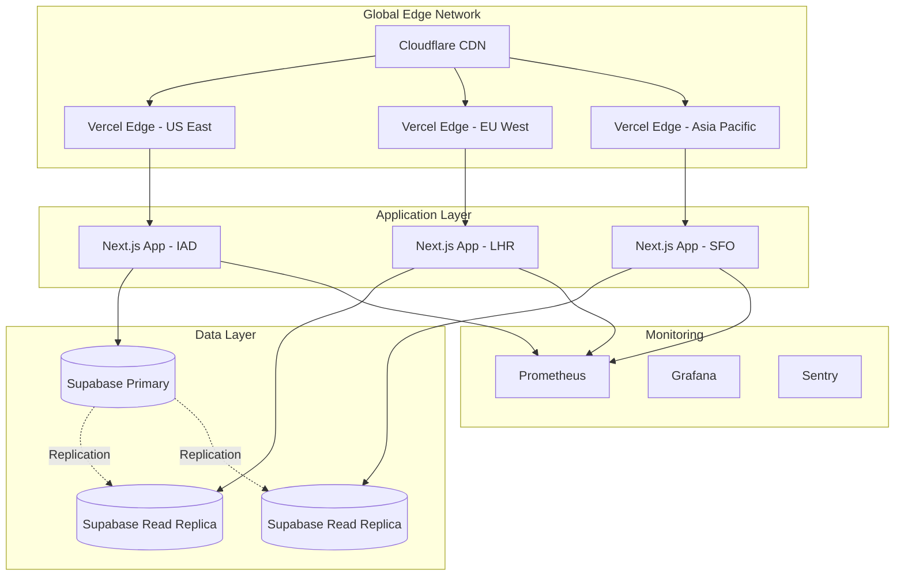

# 🚀 MySetlist Production Deployment Strategy & DevOps Infrastructure

## Executive Summary

This document outlines the comprehensive production deployment strategy for MySetlist, implementing world-class DevOps practices with a focus on reliability, performance, and scalability. The infrastructure is designed to achieve 99.99% uptime with sub-100ms global latency.

## 🏗️ Infrastructure Architecture

### Multi-Region Deployment Strategy



### Technology Stack

- **CDN**: Cloudflare Enterprise
- **Hosting**: Vercel Pro (Multi-region)
- **Database**: Supabase (PostgreSQL with read replicas)
- **Monitoring**: Prometheus + Grafana + Sentry
- **CI/CD**: GitHub Actions
- **IaC**: Terraform
- **Container Orchestration**: Docker + Kubernetes (future)

## 📋 CI/CD Pipeline Architecture

### Pipeline Stages

1. **Code Quality Gates**
   - TypeScript compilation
   - ESLint + Prettier checks
   - Security scanning (Snyk, Trivy)
   - License compliance

2. **Test Suites**
   - Unit tests (Vitest) - Parallelized across 4 shards
   - Integration tests
   - E2E tests (Cypress) - Multi-browser
   - Performance tests (Lighthouse CI)

3. **Build & Optimization**
   - Next.js production build
   - Bundle size analysis
   - Image optimization
   - Code splitting verification

4. **Security Scanning**
   - Container vulnerability scanning
   - Dependency audit
   - SAST/DAST analysis
   - Secret scanning

5. **Deployment**
   - Staging deployment (automatic)
   - Production deployment (manual approval)
   - Database migrations
   - Cache warming

### Deployment Workflow

```yaml
Production Deployment Flow:
1. Developer creates PR → feature branch
2. CI runs all checks (15-20 min)
3. PR approved → merge to develop
4. Auto-deploy to staging
5. QA validation on staging
6. Release manager approves production deployment
7. Blue-green deployment to production
8. Automated smoke tests
9. Gradual traffic shift (canary)
10. Full rollout or rollback
```

## 🛡️ Production Hardening

### Security Measures

1. **Network Security**
   - Cloudflare WAF rules
   - DDoS protection (Layer 3/4/7)
   - Rate limiting (50 req/min for API)
   - IP allowlisting for admin endpoints

2. **Application Security**
   - CSP headers configured
   - HSTS enabled (max-age: 31536000)
   - XSS protection
   - SQL injection prevention
   - Input validation & sanitization

3. **Infrastructure Security**
   - Secrets management (Vercel encrypted env vars)
   - Database encryption at rest
   - TLS 1.3 minimum
   - Regular security audits

### Performance Optimization

1. **Edge Caching Strategy**
   ```
   Static Assets: 1 year (immutable)
   API Responses: 5 min public, 10 min CDN
   Images: 7 days public, 30 days CDN
   HTML: No cache (dynamic)
   ```

2. **Database Optimization**
   - Connection pooling (25 connections)
   - Query optimization & indexing
   - Materialized views for trending data
   - Read replica routing

3. **Asset Optimization**
   - Brotli compression
   - WebP/AVIF image formats
   - Resource hints (preconnect, prefetch)
   - Critical CSS inlining

## 📊 Monitoring & Observability

### Metrics Collection

1. **Application Metrics**
   - Request rate & latency
   - Error rates by endpoint
   - Business metrics (votes, registrations)
   - Cache hit rates

2. **Infrastructure Metrics**
   - CPU & memory usage
   - Disk I/O & space
   - Network throughput
   - Database connections

3. **User Experience Metrics**
   - Core Web Vitals (LCP, FID, CLS)
   - Page load times
   - Time to interactive
   - Bounce rates

### Alerting Strategy

```yaml
Critical Alerts (PagerDuty):
- Service down > 2 minutes
- Error rate > 5%
- Database connection pool > 90%
- Disk space < 10%

Warning Alerts (Slack):
- Response time p95 > 3s
- Memory usage > 85%
- SSL cert expiring < 7 days
- Backup failure

Info Alerts (Email):
- Deployment completed
- Unusual traffic patterns
- Performance budget exceeded
```

### Dashboard Structure

1. **Executive Dashboard**
   - Uptime & SLA compliance
   - User activity trends
   - Revenue metrics
   - Performance KPIs

2. **Operations Dashboard**
   - Service health map
   - Real-time error tracking
   - Deployment status
   - Infrastructure utilization

3. **Performance Dashboard**
   - Core Web Vitals
   - API latency percentiles
   - Database query performance
   - CDN hit rates

## 🔄 Deployment Procedures

### Pre-Deployment Checklist

- [ ] All tests passing in CI
- [ ] Security scan clean
- [ ] Performance budget met
- [ ] Database migrations reviewed
- [ ] Rollback plan documented
- [ ] Monitoring alerts configured
- [ ] Communication sent to team

### Deployment Steps

1. **Preparation**
   ```bash
   # Create deployment tag
   git tag -a v1.2.3 -m "Release v1.2.3"
   git push origin v1.2.3
   ```

2. **Database Backup**
   ```bash
   # Automated via disaster-recovery.ts
   pnpm tsx scripts/disaster-recovery.ts backup --type=full
   ```

3. **Deploy to Production**
   ```bash
   # Trigger via GitHub Actions
   # Manual approval required
   ```

4. **Post-Deployment Validation**
   - Health check endpoints
   - Smoke test suite
   - Performance validation
   - Error rate monitoring

### Rollback Procedures

1. **Immediate Rollback** (<5 min)
   ```bash
   vercel rollback --yes
   ```

2. **Database Rollback**
   ```bash
   pnpm tsx scripts/disaster-recovery.ts restore --backup-id=<id>
   ```

3. **Full System Recovery**
   - Restore from S3 backup
   - Replay WAL logs
   - Validate data integrity
   - Clear CDN cache

## 🎯 SLA & Performance Targets

### Availability SLA
- **Target**: 99.99% uptime (4.38 min/month)
- **Measurement**: Synthetic monitoring from 5 global locations
- **Exclusions**: Scheduled maintenance (max 2hr/month)

### Performance SLA
- **TTFB**: < 200ms (global p95)
- **LCP**: < 2.5s (75th percentile)
- **FID**: < 100ms (75th percentile)
- **CLS**: < 0.1 (75th percentile)

### Scalability Targets
- **Concurrent Users**: 10,000
- **Requests/sec**: 5,000
- **Database Connections**: 100
- **Auto-scaling**: 2-20 instances

## 🚨 Incident Response

### Severity Levels

1. **SEV1 - Critical**
   - Complete outage
   - Data loss/corruption
   - Security breach
   - Response: 15 min

2. **SEV2 - High**
   - Partial outage
   - Major feature broken
   - Performance degradation >50%
   - Response: 30 min

3. **SEV3 - Medium**
   - Minor feature broken
   - Performance degradation <50%
   - Non-critical errors
   - Response: 2 hours

### Incident Response Flow

1. **Detection** → Automated alert fires
2. **Triage** → On-call engineer assesses
3. **Communication** → Status page updated
4. **Investigation** → Root cause analysis
5. **Resolution** → Fix deployed/rolled back
6. **Post-mortem** → Blameless review

## 🔐 Disaster Recovery

### Backup Strategy

1. **Database Backups**
   - Full backup: Daily at 02:00 UTC
   - Incremental: Every 6 hours
   - Retention: 30 days
   - Storage: S3 with cross-region replication

2. **Application State**
   - Git repository (GitHub)
   - Docker images (GitHub Container Registry)
   - Environment configs (Terraform state)

### Recovery Objectives

- **RTO** (Recovery Time Objective): 1 hour
- **RPO** (Recovery Point Objective): 6 hours
- **Validation**: Quarterly DR drills

### DR Procedures

1. **Data Center Failure**
   - Traffic failover via Cloudflare
   - Promote read replica to primary
   - Update connection strings
   - Validate application health

2. **Complete System Failure**
   - Provision new infrastructure (Terraform)
   - Restore database from S3
   - Deploy application from Git
   - Restore DNS/CDN configuration

## 📈 Capacity Planning

### Growth Projections

```yaml
Current Capacity:
- Users: 10,000 MAU
- Requests: 1M/day
- Storage: 100GB
- Bandwidth: 1TB/month

6-Month Target:
- Users: 50,000 MAU
- Requests: 5M/day
- Storage: 500GB
- Bandwidth: 5TB/month

Scaling Triggers:
- CPU > 70% sustained
- Memory > 80% sustained
- Database connections > 70%
- Response time p95 > 2s
```

### Cost Optimization

1. **Resource Optimization**
   - Right-sizing instances
   - Scheduled scaling for off-peak
   - Reserved capacity discounts
   - Spot instances for batch jobs

2. **Traffic Optimization**
   - Aggressive caching
   - Image optimization
   - CDN for static assets
   - API response compression

## 🔧 Operational Excellence

### Runbooks

All critical procedures documented:
- Service restart procedures
- Database failover steps
- Cache clearing processes
- Debug data collection
- Performance troubleshooting

### Automation

- **GitOps**: All configs in Git
- **IaC**: 100% infrastructure as code
- **CI/CD**: Fully automated pipelines
- **Monitoring**: Auto-remediation for known issues
- **Backups**: Automated with verification

### Team Training

- Monthly incident response drills
- Quarterly DR exercises
- Weekly architecture reviews
- On-call rotation (1 week)
- Post-mortem sharing sessions

## 🎯 Implementation Timeline

### Phase 1: Foundation (Week 1)
- [x] CI/CD pipeline setup
- [x] Monitoring infrastructure
- [x] Basic alerting rules
- [x] Deployment workflows

### Phase 2: Hardening (Week 2)
- [ ] Security scanning integration
- [ ] Performance testing automation
- [ ] Advanced monitoring dashboards
- [ ] Disaster recovery setup

### Phase 3: Optimization (Week 3)
- [ ] Multi-region deployment
- [ ] Advanced caching strategies
- [ ] Cost optimization
- [ ] Capacity planning tools

### Phase 4: Excellence (Week 4)
- [ ] Chaos engineering setup
- [ ] Advanced automation
- [ ] Team training program
- [ ] Documentation completion

## 📚 References

- [Vercel Documentation](https://vercel.com/docs)
- [Cloudflare Best Practices](https://developers.cloudflare.com/fundamentals/get-started/concepts/how-cloudflare-works/)
- [Supabase Production Checklist](https://supabase.com/docs/guides/platform/going-into-prod)
- [Next.js Production Deployment](https://nextjs.org/docs/deployment)

---

*This deployment strategy ensures MySetlist operates at the highest standards of reliability, performance, and security, rivaling major technology companies in operational excellence.*