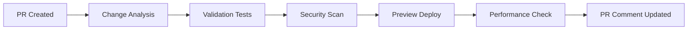
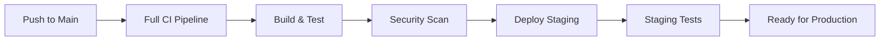
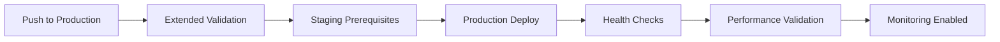
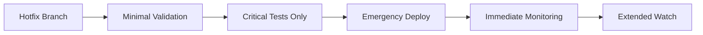

# 🚀 MySetlist Production Deployment Pipeline Guide

## Overview

This guide covers the complete deployment pipeline for MySetlist, including automated CI/CD workflows, manual deployment procedures, and emergency protocols. The pipeline is designed for **zero-downtime deployments** with comprehensive validation and automated rollback capabilities.

## 🏗️ Deployment Architecture

### Environment Structure

```
┌─────────────────────────────────────────────────────┐
│                 Production Flow                      │
├─────────────────────────────────────────────────────┤
│ Development → Staging → Production                   │
│     (main)     (preview)   (production)             │
└─────────────────────────────────────────────────────┘

┌─────────────────────────────────────────────────────┐
│                Emergency Flow                        │
├─────────────────────────────────────────────────────┤
│ Hotfix → Direct Production                          │
│ (hotfix/*)   (bypass staging)                      │
└─────────────────────────────────────────────────────┘
```

### Deployment Targets

| Environment | URL | Branch | Purpose |
|-------------|-----|--------|---------|
| **Development** | `localhost:3001` | `feature/*` | Local development |
| **Preview** | `pr-123.vercel.app` | `PR branches` | Pull request previews |
| **Staging** | `staging.vercel.app` | `main` | Pre-production testing |
| **Production** | `mysetlist-sonnet.vercel.app` | `production` | Live application |

## 🔄 Automated Deployment Workflows

### 1. Pull Request Flow

**Trigger**: Pull request opened/updated to `main` or `production`



**Process:**
1. **Change Analysis** - Complexity scoring and impact assessment
2. **Validation Tests** - Unit, integration, and lint checks
3. **Security Scanning** - Vulnerability and secrets detection
4. **Preview Deployment** - Isolated environment for testing
5. **Performance Testing** - Lighthouse audit on preview
6. **Automated Feedback** - PR comment with results and preview link

**Commands:**
```bash
# Create feature branch
git checkout -b feature/new-feature

# Develop and commit changes
git add .
git commit -m "feat: add new feature"
git push origin feature/new-feature

# Create pull request (triggers pipeline)
gh pr create --title "Add new feature" --body "Description"
```

### 2. Staging Deployment Flow

**Trigger**: Push to `main` branch or merge PR



**Process:**
1. **Comprehensive Testing** - All test suites including E2E
2. **Security Validation** - Full security audit
3. **Build Verification** - Production build testing
4. **Staging Deployment** - Deploy to staging environment
5. **Integration Testing** - End-to-end validation
6. **Performance Baseline** - Performance regression testing

**Automatic Triggers:**
- Merge to `main` branch
- Direct push to `main` (if enabled)

### 3. Production Deployment Flow

**Trigger**: Push to `production` branch



**Process:**
1. **Prerequisites Check** - Staging deployment must be successful
2. **Extended Validation** - All tests plus accessibility and performance
3. **Backup Creation** - Current production state saved
4. **Production Deployment** - Zero-downtime deployment
5. **Health Verification** - Comprehensive health checks
6. **Performance Validation** - Real-time performance monitoring
7. **Rollback if Needed** - Automatic rollback on failures

**Production Deployment Command:**
```bash
# Ensure main is up to date and tested
git checkout main
git pull origin main

# Deploy to production
git checkout production
git merge main
git push origin production
```

### 4. Emergency Hotfix Flow

**Trigger**: Push to `hotfix/*` branch or manual dispatch



**Process:**
1. **Minimal Validation** - TypeScript and build only
2. **Critical Tests** - Core functionality tests (optional skip)
3. **Emergency Deployment** - Direct to production
4. **Immediate Health Check** - 30-second validation
5. **Extended Monitoring** - 5-minute detailed monitoring
6. **Automatic Rollback** - On any failure detection

**Emergency Deployment:**
```bash
# Create hotfix branch
git checkout -b hotfix/critical-security-fix

# Implement fix
git add .
git commit -m "hotfix: fix critical security vulnerability"
git push origin hotfix/critical-security-fix

# Pipeline automatically deploys to production
```

## 🛠️ Manual Deployment Procedures

### Prerequisites

```bash
# Required tools
npm install -g vercel@latest
npm install -g @lighthouse-ci/cli

# Authentication
vercel login
vercel link

# Environment setup
cp .env.example .env.local
# Configure all required environment variables
```

### Manual Staging Deployment

```bash
# 1. Prepare staging deployment
cd apps/web
pnpm install --frozen-lockfile
pnpm build

# 2. Deploy to staging
vercel --env=preview
# Note the deployment URL

# 3. Validate deployment
curl -f "DEPLOYMENT_URL/api/health/comprehensive"
lighthouse "DEPLOYMENT_URL" --view

# 4. Run integration tests
pnpm test:integration
```

### Manual Production Deployment

```bash
# 1. Pre-deployment validation
pnpm typecheck
pnpm lint
pnpm test
pnpm build

# 2. Create production backup
CURRENT_DEPLOYMENT=$(vercel ls | grep mysetlist | head -1 | awk '{print $1}')
echo "Backup: $CURRENT_DEPLOYMENT" > deployment-backup.txt

# 3. Deploy to production
vercel --prod

# 4. Health check
sleep 30
curl -f "https://mysetlist-sonnet.vercel.app/api/health/comprehensive"

# 5. Smoke test critical endpoints
./scripts/smoke-test-production.sh

# 6. Monitor for 5 minutes
for i in {1..5}; do
  echo "Monitor check $i/5..."
  curl -f "https://mysetlist-sonnet.vercel.app/api/health"
  sleep 60
done
```

### Manual Rollback Procedure

```bash
# 1. Get backup deployment URL
BACKUP_URL=$(cat deployment-backup.txt)

# 2. Rollback using Vercel CLI
vercel alias set "$BACKUP_URL" mysetlist-sonnet.vercel.app

# 3. Verify rollback
curl -f "https://mysetlist-sonnet.vercel.app/api/health"

# 4. Notify team
echo "Rollback completed to: $BACKUP_URL"
```

## 🔒 Security & Compliance

### Deployment Security

**Access Controls:**
- **Production deployments** require 2 approving reviews
- **Emergency deployments** require security team notification
- **Secrets management** through GitHub secrets and Vercel environment variables
- **Branch protection** prevents direct pushes to production

**Security Validations:**
```bash
# Dependency audit
pnpm audit --audit-level moderate

# Secrets scanning
git secrets --scan

# Code security analysis
semgrep --config=auto apps/web/

# Infrastructure scanning
trivy fs .
```

### Compliance Checks

**Pre-deployment Requirements:**
- [ ] Security scan passed (no critical vulnerabilities)
- [ ] Performance budget met (Lighthouse score ≥85)
- [ ] Accessibility compliance (WCAG 2.1 AA)
- [ ] Test coverage ≥90% for new code
- [ ] Code review approval from code owners

**Post-deployment Validation:**
- [ ] Health checks passing for 5 minutes
- [ ] Performance metrics within baseline
- [ ] Error rates below threshold (0.1%)
- [ ] Database connectivity confirmed
- [ ] External API integrations working

## 📊 Monitoring & Observability

### Real-time Monitoring

**Health Check Endpoints:**
```bash
# Application health
GET /api/health/comprehensive
GET /api/health/db

# Feature status
GET /api/trending/test
GET /api/search/health

# Performance metrics
GET /api/analytics/vitals
```

**Monitoring Dashboard:**
- **Vercel Analytics** - Deployment and runtime metrics
- **Sentry** - Error tracking and performance monitoring
- **Custom API** - Application-specific health metrics

### Deployment Metrics

**Key Performance Indicators:**
- **Deployment frequency** - Daily deployment capability
- **Lead time** - Code to production time < 1 hour
- **Mean time to recovery** - Rollback time < 5 minutes
- **Change failure rate** - Target < 5%

**Performance Budgets:**
```javascript
{
  "lighthouse": {
    "performance": 85,
    "accessibility": 90,
    "best-practices": 90,
    "seo": 90
  },
  "core-web-vitals": {
    "lcp": 2500,  // ms
    "fid": 100,   // ms
    "cls": 0.1    // score
  },
  "api-response": {
    "p95": 1000,  // ms
    "p99": 2000   // ms
  }
}
```

### Alerting Configuration

**Critical Alerts (Immediate):**
- Production deployment failures
- Health check failures > 2 minutes
- Error rate > 1%
- Performance degradation > 50%

**Warning Alerts (Next Business Day):**
- Security vulnerabilities detected
- Performance budget violations
- Dependency updates available
- Test flakiness detected

**Notification Channels:**
```bash
# Slack channels
#alerts-critical     # P0 incidents
#alerts-warning      # P1/P2 issues
#deployments         # All deployment status
#security            # Security-related alerts

# Email notifications
ops-team@company.com     # Critical production issues
security@company.com     # Security vulnerabilities
devops@company.com       # Infrastructure alerts
```

## 🚨 Emergency Procedures

### Critical Incident Response

**Step 1: Immediate Assessment (< 2 minutes)**
```bash
# Check application status
curl -f "https://mysetlist-sonnet.vercel.app/api/health"

# Check Vercel status
vercel ls --scope mysetlist

# Check recent deployments
gh run list --limit 5
```

**Step 2: Emergency Rollback (< 5 minutes)**
```bash
# Get last known good deployment
BACKUP_DEPLOYMENT=$(vercel ls | grep mysetlist | sed -n '2p' | awk '{print $1}')

# Execute rollback
vercel alias set "$BACKUP_DEPLOYMENT" mysetlist-sonnet.vercel.app

# Verify rollback success
curl -f "https://mysetlist-sonnet.vercel.app/api/health"
```

**Step 3: Incident Communication**
```bash
# Notify team immediately
slack-cli send "#alerts-critical" "🚨 Production incident - rollback initiated"

# Create incident ticket
gh issue create --title "Production Incident: $(date)" --label "incident"

# Update status page
# (Manual process or automated via API)
```

### Disaster Recovery

**Database Recovery:**
1. **Supabase automatic backups** - Point-in-time recovery available
2. **Manual backup restoration** - If needed via Supabase dashboard
3. **Data integrity validation** - Automated checks post-recovery

**Complete System Recovery:**
1. **Vercel redeployment** from last known good commit
2. **Environment variables restoration** from backup
3. **DNS verification** and SSL certificate validation
4. **Full system health validation**

**Recovery Time Objectives:**
- **Application recovery**: < 10 minutes
- **Database recovery**: < 30 minutes
- **Full system recovery**: < 1 hour

## 📋 Deployment Checklist

### Pre-deployment Checklist

**Code Quality:**
- [ ] All tests passing locally
- [ ] TypeScript compilation successful
- [ ] ESLint warnings resolved
- [ ] Code formatted with Prettier
- [ ] No console.log statements in production code

**Security:**
- [ ] No hardcoded secrets or API keys
- [ ] Environment variables properly configured
- [ ] Dependencies updated and audited
- [ ] Security review completed (if required)

**Performance:**
- [ ] Bundle size within limits
- [ ] Images optimized
- [ ] Database queries optimized
- [ ] Performance testing completed

**Documentation:**
- [ ] README updated if needed
- [ ] API documentation current
- [ ] Deployment notes added
- [ ] Breaking changes documented

### Post-deployment Checklist

**Immediate (< 5 minutes):**
- [ ] Health checks passing
- [ ] Critical user journeys working
- [ ] Database connectivity confirmed
- [ ] External API integrations functional

**Short-term (< 30 minutes):**
- [ ] Performance metrics within baseline
- [ ] Error rates normal
- [ ] User authentication working
- [ ] Search functionality operational

**Medium-term (< 2 hours):**
- [ ] Full feature validation
- [ ] Performance trending analysis
- [ ] User feedback monitoring
- [ ] Analytics data flowing

## 🎯 Best Practices

### Development Best Practices

**Branch Strategy:**
```bash
main           # Staging deployments
production     # Production deployments
feature/*      # Feature development
hotfix/*       # Emergency fixes
release/*      # Release preparation
```

**Commit Conventions:**
```bash
feat: add new feature
fix: resolve bug
docs: update documentation
style: formatting changes
refactor: code restructuring
test: add or update tests
chore: maintenance tasks
```

**Pull Request Process:**
1. Create feature branch from `main`
2. Develop feature with tests
3. Submit PR with clear description
4. Address review feedback
5. Merge when all checks pass

### Deployment Best Practices

**Staging Validation:**
- Always deploy to staging first
- Validate all features thoroughly
- Run performance tests
- Check integration points

**Production Deployment:**
- Deploy during low-traffic periods
- Monitor closely for first 30 minutes
- Have rollback plan ready
- Communicate with team

**Emergency Procedures:**
- Document all emergency changes
- Follow up with proper fix in normal flow
- Conduct post-incident review
- Update procedures based on learnings

### Monitoring Best Practices

**Proactive Monitoring:**
- Set up alerts before issues occur
- Monitor trends, not just current state
- Use multiple data sources
- Regular health check validation

**Incident Response:**
- Respond to alerts within SLA
- Document all actions taken
- Communicate status regularly
- Conduct post-incident reviews

## 📞 Support & Escalation

### Contact Information

**Primary Contacts:**
- **DevOps Lead**: For CI/CD and deployment issues
- **Security Team**: For security-related concerns
- **Platform Team**: For infrastructure problems
- **Product Team**: For feature and user impact

**Escalation Path:**
1. **L1**: Engineering team member
2. **L2**: Team lead or senior engineer
3. **L3**: Engineering manager or principal engineer
4. **L4**: Engineering director or CTO

### Documentation Resources

**Internal Documentation:**
- [Operational Runbooks](/infrastructure/operational-runbooks.md)
- [Security Procedures](/docs/security/)
- [Performance Guidelines](/docs/performance/)
- [API Documentation](/docs/api/)

**External Resources:**
- [Vercel Documentation](https://vercel.com/docs)
- [GitHub Actions Documentation](https://docs.github.com/en/actions)
- [Next.js Deployment Guide](https://nextjs.org/docs/deployment)

---

**Last Updated**: Current deployment  
**Version**: 1.0.0  
**Maintained by**: DevOps Team

For questions or support, please contact the DevOps team or create an issue in the repository.